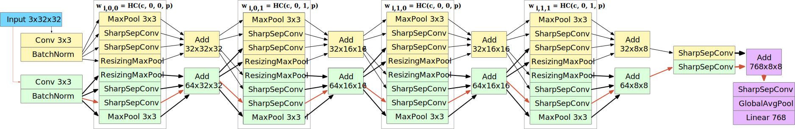
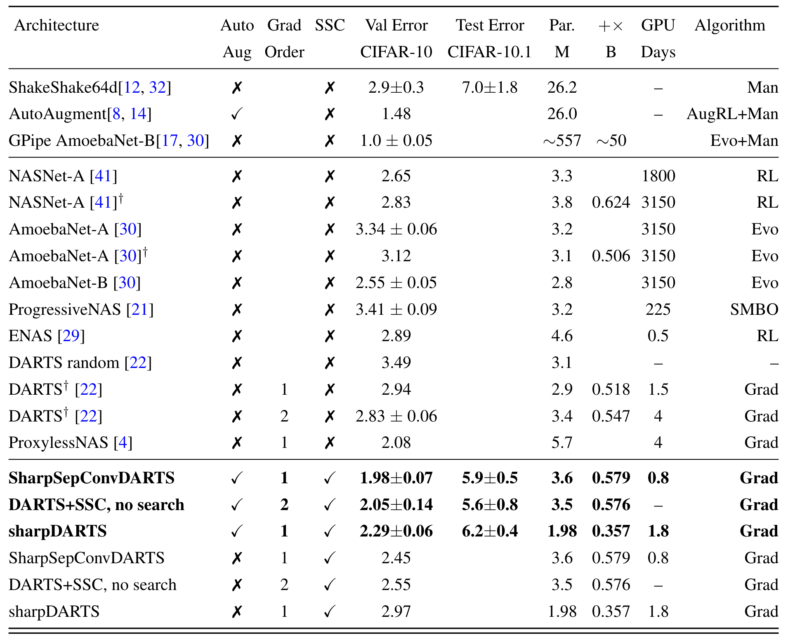
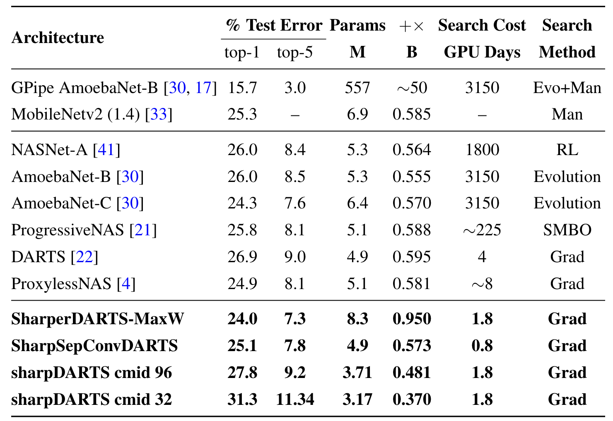
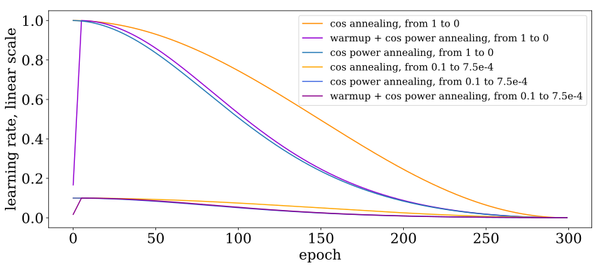
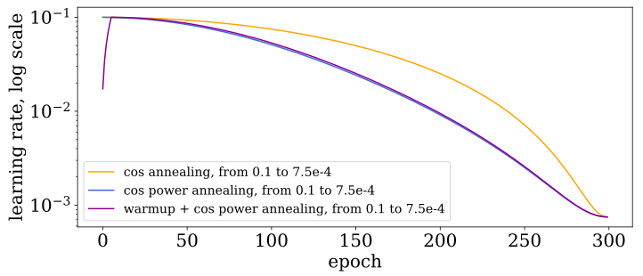

# sharpDARTS: Faster and More Accurate Differentiable Architecture Search



[](https://paperswithcode.com/sota/neural-architecture-search-on-cifar-10?p=sharpdarts-faster-and-more-accurate)

Please cite [sharpDARTS: Faster and More Accurate Differentiable Architecture Search](http://arxiv.org/abs/1903.09900) if you use this code as part of your research! By using any part of the code you are agreeing to comply with our permissive Apache 2.0 license.

```
@article{hundt2019sharpdarts,
  author    = {Andrew Hundt and
               Varun Jain and
               Gregory D. Hager},
  title     = {sharpDARTS: Faster and More Accurate Differentiable Architecture Search},
  journal   = {CoRR},
  volume    = {abs/1903.09900},
  year      = {2019},
  url       = {http://arxiv.org/abs/1903.09900},
  archivePrefix = {arXiv},
  eprint    = {1903.09900},
  biburl    = {https://dblp.org/rec/bib/journals/corr/abs-1903-09900},
  bibsource = {dblp computer science bibliography, https://dblp.org}
}
```

Requires pytorch 1.0. References and licenses for external code sources are included inline in the source code itself.

## Searching for a model

To see the configuration options, run `python3 train_search.py --help` from the directory `cnn`. The code is also commented.



### Scalar Search

Here is how to do a search configured to find a model like SharpSepConvDARTS:

```
export CUDA_VISIBLE_DEVICES="0" && python3 train_search.py --dataset cifar10 --batch_size 48 --layers_of_cells 8 --layers_in_cells 4 --save scalar_SharpSepConvDARTS_SEARCH_`git rev-parse --short HEAD` --init_channels 16 --epochs 120 --cutout --autoaugment --seed 22 --weighting_algorithm scalar --primitives DARTS_PRIMITIVES
```

### Max-W Regularization Search

```
export CUDA_VISIBLE_DEVICES="0" && python3 train_search.py --dataset cifar10 --batch_size 48 --layers_of_cells 8 --layers_in_cells 4 --save max_w_SharpSepConvDARTS_SEARCH_`git rev-parse --short HEAD` --init_channels 16 --epochs 120 --cutout --autoaugment --seed 22 --weighting_algorithm max_w --primitives DARTS_PRIMITIVES
```

### Add Search Results to the Code

After running `cnn/train_search.py` with your configuration, place the best genotype printout `genotype = ...` into `genotypes.py` with a unique name. We suggest also adding a record of your command, the git commit version, and a copy of the raw weights, and other command execution data so similar results can be reproduced in the future.

### Visualization

Here are examples of how to visualize the cell structures from a genotype definition found in `genotypes.py`:
```
cd cnn

python3 visualize.py SHARPSEPCONV_DARTS
python3 visualize.py SHARP_DARTS
python3 visualize.py DARTS
```

## Training a Final Model

To see the configuration options, run `python3 train.py --help` from the directory `cnn`. The code is also commented.

### CIFAR-10 Training

To reproduce the SharpSepConvDARTS results with 1.93% (1.98+/-0.07) validation error on CIFAR-10 and 5.5% error (5.8+/-0.3) on the CIFAR-10.1 test set:

```
export CUDA_VISIBLE_DEVICES="0" && python3 train.py --autoaugment --auxiliary --cutout --batch_size 64 --epochs 2000 --save SHARPSEPCONV_DARTS_2k_`git rev-parse --short HEAD`_cospower_min_1e-8 --arch SHARPSEPCONV_DARTS --learning_rate 0.025 --learning_rate_min 1e-8 --cutout_length 16 --init_channels 36 --dataset cifar10
```

Collecting multiple data points:

```
for i in {1..8}; do export CUDA_VISIBLE_DEVICES="0" && python3 train.py --autoaugment --auxiliary --cutout --batch_size 64 --epochs 2000 --save SHARPSEPCONV_DARTS_MAX_W_2k_`git rev-parse --short HEAD`_cospower_min_1e-8 --learning_rate 0.025 --learning_rate_min 1e-8 --cutout_length 16 --init_channels 36 --dataset cifar10 --arch SHARPSEPCONV_DARTS_MAX_W ; done;
```

Collecting results from multiple runs into a file from `sharperDARTS/cnn` directory with [ack-grep](https://beyondgrep.com/) (on some machines the command is just `ack`):
```
ack-grep  --match "cifar10.1" */*.txt > cifar10.1_results_femur.txt
```

### ImageNet Training



We train with a modified version the fp16 optimizer from [APEX](https://github.com/NVIDIA/apex), we suspect this means results will be slightly below the ideal possible accuracy, but training time is substantially reduced.
These configurations are designed for an NVIDIA RTX 1080Ti, `--fp16` should be removed for older GPUs.

You'll need to first [acquire the imagenet files](http://image-net.org/download) and preprocess them.

Training a SharpSepConvDARTS model on ImageNet where we expect approximately 25.1% top-1 (7.8% top-5) error:

```
python3 -m torch.distributed.launch --nproc_per_node=2 main_fp16_optimizer.py --fp16 --b 224 --save `git rev-parse --short HEAD`_DARTS_PRIMITIVES_DIL_IS_SEPCONV --epochs 300 --dynamic-loss-scale --workers 20 --autoaugment --auxiliary --cutout --data /home/costar/datasets/imagenet/ --learning_rate 0.05 --learning_rate_min 0.00075 --arch DARTS_PRIMITIVES_DIL_IS_SEPCONV
```

Resuming Training (you may need to do this if your results don't match the paper on the first run):

You'll need to make sure to specify the correct checkpoint directory, which will change every run.

```
python3 -m torch.distributed.launch --nproc_per_node=2 main_fp16_optimizer.py --fp16 --b 224 --save `git rev-parse --short HEAD`_DARTS_PRIMITIVES_DIL_IS_SEPCONV --epochs 100 --dynamic-loss-scale --workers 20 --autoaugment --auxiliary --cutout --data /home/costar/datasets/imagenet/ --learning_rate 0.0005 --learning_rate_min 0.0000075 --arch DARTS_PRIMITIVES_DIL_IS_SEPCONV --resume eval-20190213-182625-975c657_DARTS_PRIMITIVES_DIL_IS_SEPCONV-imagenet-DARTS_PRIMITIVES_DIL_IS_SEPCONV-0/checkpoint.pth.tar
```

Training SHARP_DARTS model on ImageNet:

```
export CUDA_VISIBLE_DEVICES="0" && python3 main_fp16_optimizer.py --fp16 --b 256 --save `git rev-parse --short HEAD` --epochs 400 --dynamic-loss-scale --workers 20 --autoaugment --auxiliary --cutout --data /home/costar/datasets/imagenet/ --learning_rate_min 1e-8 --mid_channels 96 --lr 1e-4 --load eval-20190222-175718-4f5892f-imagenet-SHARP_DARTS-0/model_best.pth.tar
```

## Differentiable Hyperparameter Search on CIFAR-10


Searching for a Model:
```
export CUDA_VISIBLE_DEVICES="1" && python2 train_search.py --dataset cifar10 --batch_size 64 --save MULTI_CHANNEL_SEARCH_`git rev-parse --short HEAD`_search_weighting_max_w --init_channels 36 --epochs 120 --cutout --autoaugment --seed 10 --weighting_algorithm max_w --multi_channel
```

Add the best path printed during the search process to `genotypes.py`, you can see examples in that file.

Training a final model, this one will reproduce the best results from Max-W search:
```
for i in {1..5}; do export CUDA_VISIBLE_DEVICES="0" && python3 train.py --b 512 --save MULTI_CHANNEL_MAX_W_PATH_FULL_2k_`git rev-parse --short HEAD`_LR_0.1_to_1e-8 --arch MULTI_CHANNEL_MAX_W_PATH --epochs 2000 --multi_channel --cutout --autoaugment --learning_rate 0.1 ; done;
```

## Cosine Power Annealing

Cosine Power annealing is designed to be a learning rate schedule which improves on cosine annealing.
See `cosine_power_annealing.py` for the code, and `cnn/train.py` for an example of using the API.




To generate the charts above simply run `python cosine_power_annealing.py` from the `/cnn` directory.
An overview of the `cosine_power_annealing` API is below:

```python
def cosine_power_annealing(
        epochs=None, max_lr=0.1, min_lr=1e-4, exponent_order=10,
        max_epoch=None, warmup_epochs=None, return_intermediates=False,
        start_epoch=1, restart_lr=True):
    """ Cosine Power annealing is designed to be an improvement on cosine annealing.

    Often the cosine annealing schedule decreases too slowly at the beginning
    and to quickly at the end. A simple exponential annealing curve does the
    opposite, decreasing too quickly at the beginning and too slowly at the end.
    Power cosine annealing strikes a configurable balance between the two.
    The larger the exponent order, the faster exponential decay occurs.
    The smaller the exponent order, the more like cosine annealing the curve becomes.

    # Arguments

    epochs: An integer indicating the number of epochs to train.
        If you are resuming from epoch 100 and want to run until epoch 300,
        specify 200.
    max_lr: The maximum learning rate which is also the initial learning rate.
    min_lr: The minimum learning rate which is also the final learning rate.
    exponent_order: Determines how fast the learning rate decays.
        A value of 1 will perform standard cosine annealing, while
        10 will decay with an exponential base of 10.
    max_epoch: The maximum epoch number that will be encountered.
        This is usually specified for when you are getting a single learning rate
        value at the current epoch, or for resuming training runs.
    return_intermediates: True changes the return value to be
        [cos_power_annealing, cos_power_proportions, cos_proportions]
        which is useful for comparing, understanding, and plotting several possible
        learning rate curves. False returns only the cos_power_annealing
        learning rate values.,
    start_epoch: The epoch number to start training from which will be at index 0
        of the returned numpy array.
    restart_lr: If True the training curve will be returned as if starting from
        epoch 1, even if you are resuming from a later epoch. Otherwise we will
        return with the learning rate as if you have already trained up to
        the value specified by start_epoch.

    # Returns

        A 1d numpy array cos_power_annealing, which will contain the learning
        rate you should use at each of the specified epochs.
    """
```

Here is the key line with the settings you'll want to use:

```python
  lr_schedule = cosine_power_annealing(
    epochs=args.epochs, max_lr=args.learning_rate, min_lr=args.learning_rate_min,
    warmup_epochs=args.warmup_epochs, exponent_order=args.lr_power_annealing_exponent_order)
```

lr_schedule is a numpy array containing the learning rate at each epoch.

## The sharpDARTS Repository is Based on Differentiable Architecture Search (DARTS)

The following is a lightly edited and updated reproduction of the README.md from the original [DARTS Code](https://github.com/quark0/darts/tree/f276dd346a09ae3160f8e3aca5c7b193fda1da37) accompanying the paper [DARTS: Differentiable Architecture Search](https://arxiv.org/abs/1806.09055):

> [DARTS: Differentiable Architecture Search](https://arxiv.org/abs/1806.09055)\
> Hanxiao Liu, Karen Simonyan, Yiming Yang.\
> _arXiv:1806.09055_.

<p align="center">
  
</p>

The algorithm is based on continuous relaxation and gradient descent in the architecture space. It is able to efficiently design high-performance convolutional architectures for image classification (on CIFAR-10 and ImageNet) and recurrent architectures for language modeling (on Penn Treebank and WikiText-2). Only a single GPU is required.

### Requirements
```
Python >= 3.5.5, PyTorch == 0.3.1, torchvision == 0.2.0
```

### Datasets
Instructions for acquiring PTB and WT2 can be found [here](https://github.com/salesforce/awd-lstm-lm). While CIFAR-10 can be automatically downloaded by torchvision, ImageNet needs to be manually downloaded (preferably to a SSD) following the instructions [here](https://github.com/pytorch/examples/tree/master/imagenet).

### Pretrained models
The easist way to get started is to evaluate our pretrained DARTS models.

**CIFAR-10** ([cifar10_model.pt](https://drive.google.com/file/d/1Y13i4zKGKgjtWBdC0HWLavjO7wvEiGOc/view?usp=sharing))
```
cd cnn && python test.py --auxiliary --model_path cifar10_model.pt
```
* Expected result: 2.63% test error rate with 3.3M model params.

**PTB** ([ptb_model.pt](https://drive.google.com/file/d/1Mt_o6fZOlG-VDF3Q5ModgnAJ9W6f_av2/view?usp=sharing))
```
cd rnn && python test.py --model_path ptb_model.pt
```
* Expected result: 55.68 test perplexity with 23M model params.

**ImageNet** ([imagenet_model.pt](https://drive.google.com/file/d/1AKr6Y_PoYj7j0Upggyzc26W0RVdg4CVX/view?usp=sharing))
```
cd cnn && python test_imagenet.py --auxiliary --model_path imagenet_model.pt
```
* Expected result: 26.7% top-1 error and 8.7% top-5 error with 4.7M model params.

### Architecture search (using small proxy models)
To carry out architecture search using 2nd-order approximation, run
```
cd cnn && python train_search.py --unrolled     # for conv cells on CIFAR-10
cd rnn && python train_search.py --unrolled     # for recurrent cells on PTB
```
Note the _validation performance in this step does not indicate the final performance of the architecture_. One must train the obtained genotype/architecture from scratch using full-sized models, as described in the next section.

Also be aware that different runs would end up with different local minimum. To get the best result, it is crucial to repeat the search process with different seeds and select the best cell(s) based on validation performance (obtained by training the derived cell from scratch for a small number of epochs). Please refer to fig. 3 and sect. 3.2 in our arXiv paper.

<p align="center">


</p>
<p align="center">
Figure: Snapshots of the most likely normal conv, reduction conv, and recurrent cells over time.
</p>

### Architecture evaluation (using full-sized models)
To evaluate our best cells by training from scratch, run
```
cd cnn && python train.py --auxiliary --cutout            # CIFAR-10
cd rnn && python train.py                                 # PTB
cd rnn && python train.py --data ../data/wikitext-2 \     # WT2
            --dropouth 0.15 --emsize 700 --nhidlast 700 --nhid 700 --wdecay 5e-7
cd cnn && python train_imagenet.py --auxiliary            # ImageNet
```
Customized architectures are supported through the `--arch` flag once specified in `genotypes.py`.

The CIFAR-10 result at the end of training is subject to variance due to the non-determinism of cuDNN back-prop kernels. _It would be misleading to report the result of only a single run_. By training our best cell from scratch, one should expect the average test error of 10 independent runs to fall in the range of 2.76 +/- 0.09% with high probability.

<p align="center">


</p>
<p align="center">
Figure: Expected learning curves on CIFAR-10 (4 runs), ImageNet and PTB.
</p>

### Visualization
Package [graphviz](https://graphviz.readthedocs.io/en/stable/index.html) is required to visualize the learned cells
```
python visualize.py DARTS
```
where `DARTS` can be replaced by any customized architectures in `genotypes.py`.

## Citations

Please cite sharpDARTS if you use the sharpDARTS code as part of your research! By using any part of the code you are agreeing to comply with our permissive Apache 2.0 license.

```
@article{hundt2019sharpdarts,
  author    = {Andrew Hundt and
               Varun Jain and
               Gregory D. Hager},
  title     = {sharpDARTS: Faster and More Accurate Differentiable Architecture Search},
  journal   = {CoRR},
  volume    = {abs/1903.09900},
  year      = {2019},
  url       = {http://arxiv.org/abs/1903.09900},
  archivePrefix = {arXiv},
  eprint    = {1903.09900},
  biburl    = {https://dblp.org/rec/bib/journals/corr/abs-1903-09900},
  bibsource = {dblp computer science bibliography, https://dblp.org}
}
```

If you use any part of the DARTS code in your research, please cite [DARTS: Differentiable Architecture Search](https://arxiv.org/abs/1806.09055):

```
@inproceedings{
    liu2018darts,
    title={{DARTS}: {D}ifferentiable {A}rchitecture {S}earch},
    author={Hanxiao Liu and Karen Simonyan and Yiming Yang},
    booktitle={International Conference on Learning Representations},
    year={2019},
    url={https://openreview.net/forum?id=S1eYHoC5FX},
}
```
